<div align="center">

# TOURNIQUET

### Fix the vulnerability without destroying the evidence.

TOURNIQUET models the evidence side effects of remediation actions and generates a
capture-first preservation sequence before destructive changes occur.

[](#testing)
[](tsconfig.json)
[](package.json)
[](#dependency-footprint)
[](SECURITY.md)
[](LICENSE)

</div>

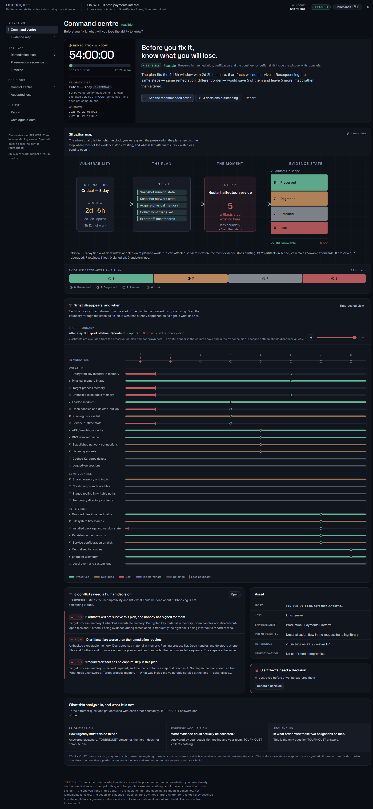

---

## The question

> **Before I fix this system, what will I permanently lose the ability to know?**

Vulnerability remediation and digital forensics want opposite things from a host.
Remediation wants the system changed — restarted, patched, rebuilt, replaced. An
investigation wants it held still long enough to understand what happened on it.

Most remediation actions destroy evidence, and the destruction is rarely obvious
from the action's name:

| Action | What is assumed | What it actually costs |
| --- | --- | --- |
| Restart a service | "It's just a restart" | The memory of the process you were investigating, and any file the attacker unlinked but left open |
| Apply a package upgrade | "It only touches the package" | The on-disk record of *which version you were actually exposed on* |
| Redeploy a container | "The new image is clean" | The image was always clean. Everything the attacker wrote was in the writable layer you just discarded |
| Revoke tokens | "Obviously the right thing" | It is. It also ends your ability to enumerate what the compromised credential could still reach |
| Isolate a host | "Isolation is safe" | Safe for the estate. It tears down the socket table, and may quietly stop the off-host logging you were relying on |

So "patch first, investigate later" becomes "patch first, permanently lose the
evidence needed to determine whether there was anything to investigate".

---

## The problem, drawn

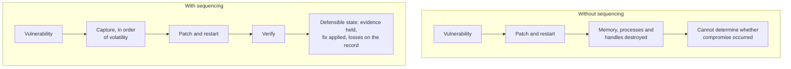

Same steps. Same remediation. Same deadline. The difference is the order — and
in the shipped demonstration, that difference is **five artifacts**.

---

## What this is, precisely

Three questions get confused with each other constantly. TOURNIQUET answers
exactly one of them.

| Question | Answered by |
| --- | --- |
| How urgently must this be fixed? | Your vulnerability management process. TOURNIQUET **consumes** the tier; it does not compute one. |
| What evidence could actually be collected? | Your acquisition tooling and your team. TOURNIQUET collects nothing. |
| **In what order must those two obligations be met?** | **This tool.** |

It is not a scanner, a CVE database, an SSVC calculator, a patch-management
platform, an acquisition tool, an EDR, or a case-management system. It does not
scan, prioritise, acquire, patch or execute anything, and it makes no network
request.

---

## How it thinks

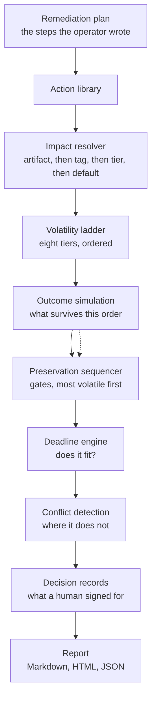

Step by step:

1. **What does this action change?** Each action declares its effects against an
   artifact, a tag, or a whole volatility tier.
2. **What evidence is affected?** The resolver takes the most specific match, and
   breaks ties at equal specificity by severity.
3. **How volatile is it?** Eight tiers, from memory to records held off the host.
4. **What must be captured first?** Captures are placed in *gates* before the
   steps that threaten what they collect.
5. **Does the plan fit?** Preservation plus remediation plus verification plus
   buffer, against the window.
6. **What conflicts remain?** Stated with options, never resolved automatically.
7. **What did the human decide?** Recorded, with a name against it.

---

## The situation map

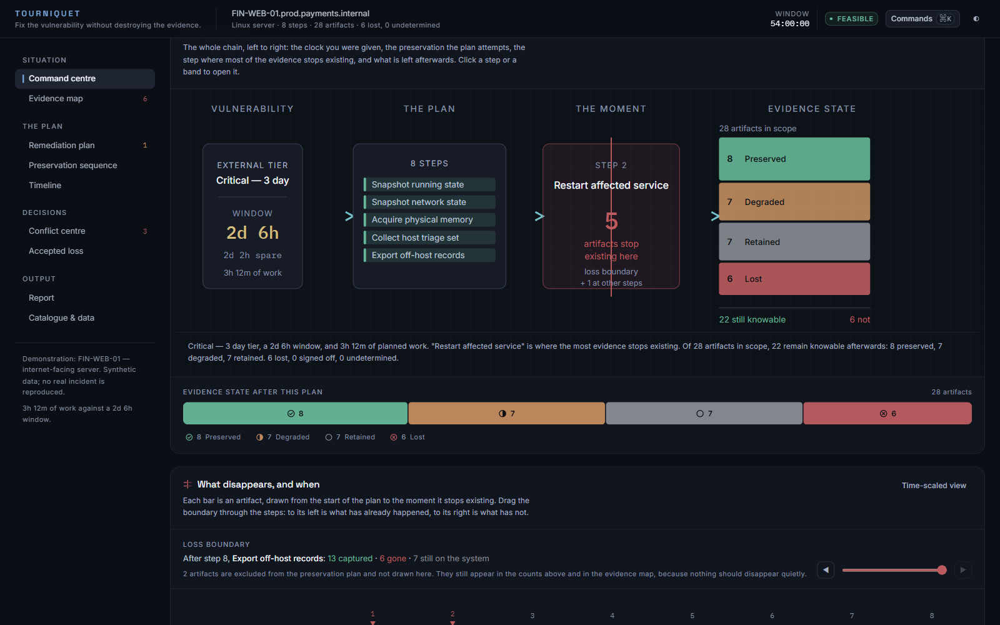

One view carrying the whole chain, left to right: the clock you were given, the
preservation the plan attempts, the single step where most of the evidence stops
existing, and what is left afterwards. Clicking a step or a band opens it.

It is a flow rather than a row of tiles because the causal claim *is* the
product. Five KPI cards say "here are five numbers"; this says "this causes
this".

---

## The loss boundary

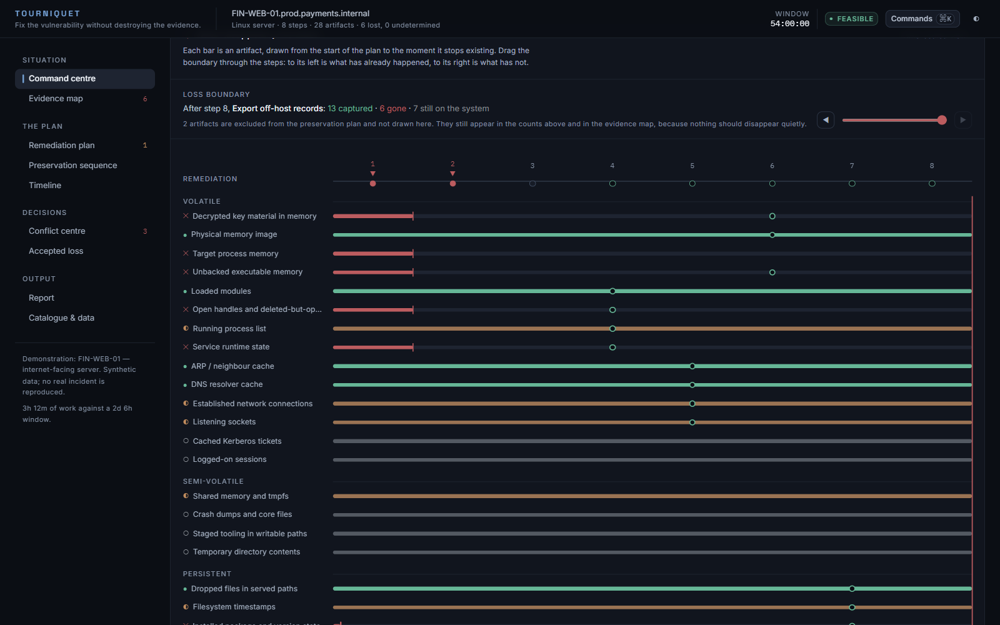

The signature interaction. Each bar is an artifact, drawn from the start of the
plan to the moment it stops existing. Drag the boundary through the steps: to
its left is what has already happened, to its right is what has not.

Three decisions in that drawing are load-bearing:

- **A lost bar is severed, not faded.** Fading says "de-emphasised". The artifact
  did not become harder to see; it stopped existing. So the bar runs at full
  strength and then stops dead, with a hard cap at the step that ended it.
- **An unknown bar is hatched and never resolves.** It does not stop at the
  uncharacterised step — that would assert destruction — and it does not continue
  cleanly, which would assert survival.
- **The axis is steps, not minutes.** Spacing by duration would make a
  forty-five-minute memory capture eleven times wider than the restart that
  destroys everything. The [timeline](#the-timeline) is the time-scaled
  companion, and it exists because these are two different questions.

---

## Action, evidence, consequence

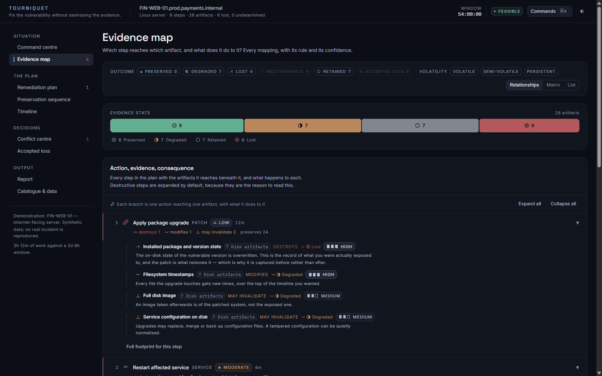

Every step with the artifacts it reaches beneath it, what it does to each, the
rule that produced the finding, and the confidence in it. Destructive steps are
expanded by default, because they are the reason to read this.

<details>
<summary><b>The same relation as a matrix</b> — every step against every artifact, at once</summary>

<br>

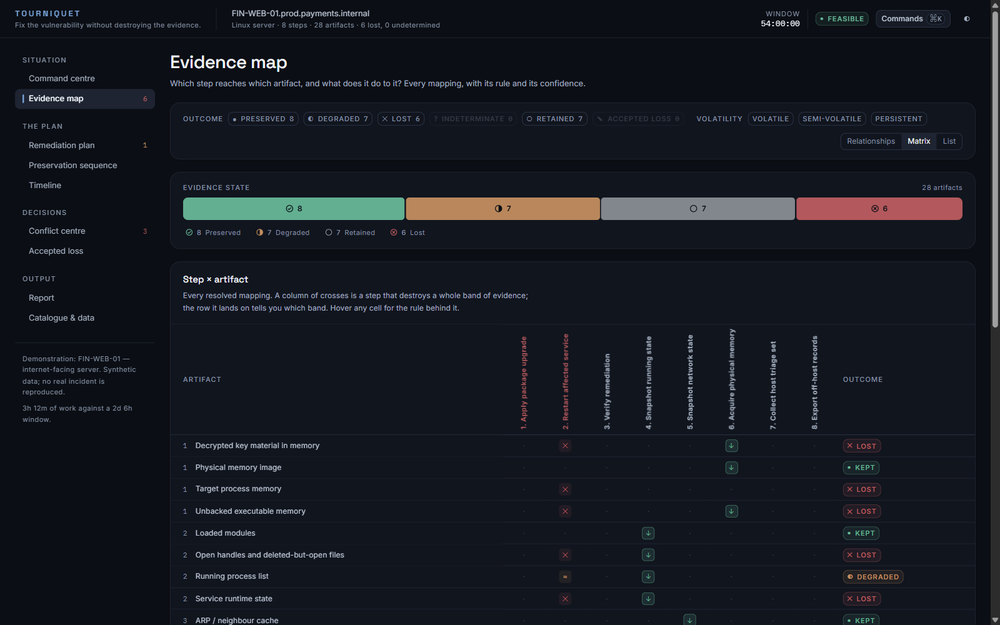

Twenty-eight artifacts against eight steps is 224 cells. The value of seeing them
together is that the *pattern* of a destructive step — a vertical stripe of
crosses through the volatile tiers — is legible before any individual cell is
read.

</details>

---

## The model

### Evidence, on a ladder

<!-- n:artifacts -->38 artifacts across <!-- n:tiers -->8 volatility tiers. The
ladder is data, in [`src/domain/volatility.ts`](src/domain/volatility.ts) — a
team whose house doctrine differs changes it in one place and every sequence,
gate, chart and report follows.

```
 1  Volatile memory      Gone the moment the host loses power or is reset
 2  Running state        Gone when the process ends
 3  Network state        Gone when the connection closes
 4  Session state        Gone when the session is terminated
 ──────────────────────  the volatile class: decays on its own
 5  Runtime artifacts    Gone when the runtime is replaced, not merely restarted
 6  Temporary state      Survives a restart; may be reaped at any time
 ──────────────────────
 7  Disk artifacts       Survives a patch; gone on rebuild
 8  Long-term records    Held off the host; usually survives everything
```

Every artifact records the investigative question it is the answer to. That is
the point of the catalogue — not "here is a thing a tool can dump", but "if this
is gone, here is what you can no longer determine".

### Five impacts, never a boolean

<!-- n:actions -->37 actions — <!-- n:captures -->18 capture steps and
<!-- n:remediations -->19 remediation steps — carrying <!-- n:rules -->107
explicit evidence rules.

| | |
| --- | --- |
| **destroys** | The artifact ceases to exist. |
| **modifies** | It still exists, but this step changed it. |
| **may invalidate** | Unchanged, but what can be concluded from it may not survive. |
| **preserves** | This step does not touch it. |
| **unknown** | Nothing here says what this step does. An open question, not a clean bill of health. |

The difference between "this is gone" and "this is still there but I can no
longer vouch for it" is most of the professional judgement in a remediation.
Collapsing it to yes/no is what would make a tool like this useless.

### The field that does the real work

Every action declares a **`default_effect`**: what it does to every artifact it
did *not* mention.

```ts
// A bounded action knows its own limits.
default_effect: {
  impact: 'preserves',
  confidence: 'high',
  rationale: 'This action is bounded to the component named above.',
}

// A vendor procedure nobody has characterised does not.
default_effect: {
  impact: 'unknown',
  confidence: 'unknown',
  rationale: 'The vendor procedure is not characterised in this library.',
}
```

Without that field the two cases would be indistinguishable, and the second would
silently be treated as the first.

> [!IMPORTANT]
> **Unknown never resolves to safe.** It is the one rule the whole product rests
> on, and it is enforced in three places: at the resolver (`unknown` outranks
> `preserves` when rules of equal specificity disagree), at the outcome
> (`indeterminate` is a state of its own), and in
> [`scripts/assert-claims.ts`](scripts/assert-claims.ts), which fails the build
> if any artifact in any shipped scenario reaches a safe outcome through an
> uncharacterised step.

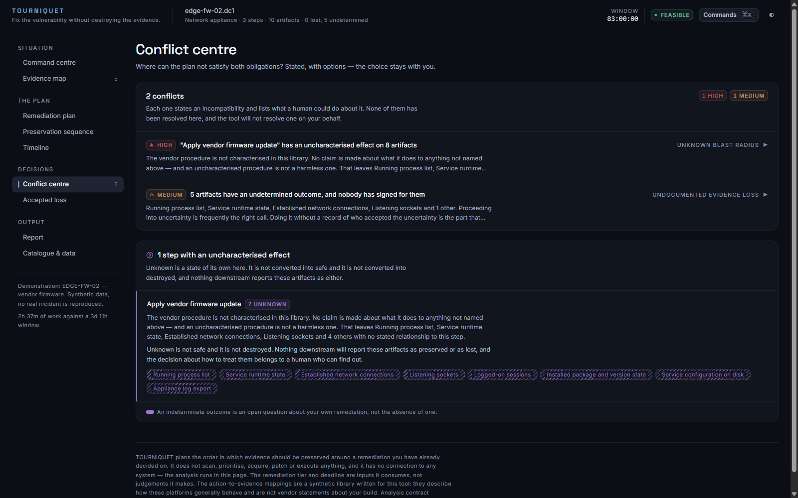

### Six outcomes

| | |
| --- | --- |
| **Preserved** | Captured, and nothing had touched it beforehand. |
| **Degraded** | A step alters it. What you can collect is the altered state. |
| **Lost** | Destroyed, with nothing capturing it first. |
| **Retained** | Nothing in the plan touches it. Still on the system afterwards. |
| **Indeterminate** | An uncharacterised step reached it first. Neither claim is supportable. |
| **Accepted loss** | Will not survive, and a named person signed for that. |

A capture step that runs *after* the destruction captures nothing. It still sits
in the plan, it still consumes the clock, and the artifact is still lost — which
is precisely the sequencing error this tool exists to find.

---

## The sequencer

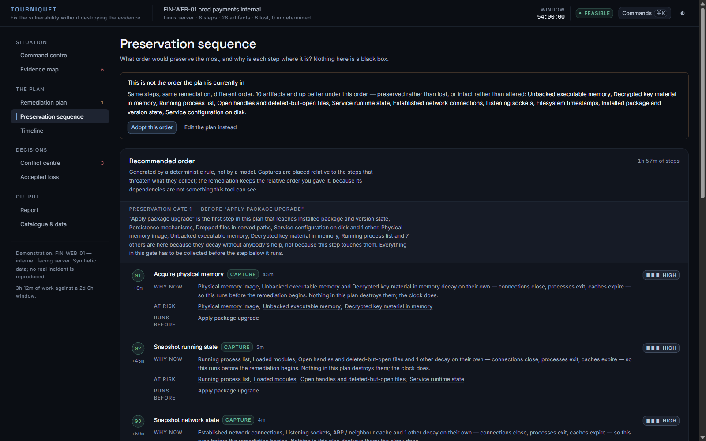

Deterministic, explainable, and narrower than it could be.

**It does not reorder remediation.** The relative order of remediation steps has
dependencies the tool cannot see — you stop the service before you replace the
binary. TOURNIQUET keeps that order exactly as written and decides only where the
captures go. A planner that shuffled remediation on evidence grounds would be
making operations decisions it has no standing to make.

**Captures go in gates, not all at the front.** A capture of stored evidence only
has to precede the first step that harms what it collects. An off-host log export
does not need to happen before a service restart that cannot reach off-host logs,
and on a tight clock that distinction is the difference between a plan that fits
and one that does not. Captures nothing in the plan threatens are placed *after*
remediation, and the sequence says why.

**Volatile evidence is exempt from that**, and this is the correction that
mattered. The first version scheduled every capture against the step that
threatened it and produced a plan where the memory image came after the package
upgrade — arithmetically defensible, because an upgrade does not touch RAM, and
wrong. Volatile evidence decays on its own. A capture taken twenty minutes later
is a capture of something else.

Within a gate: most volatile first by the ladder, then collection priority, then
the shorter capture, then the action id so the output is stable.

---

## The timeline

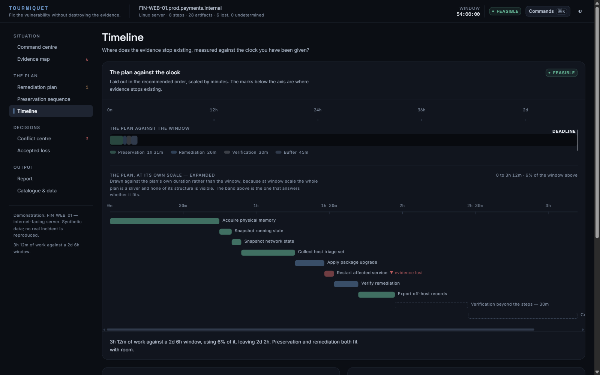

Two scales, deliberately. The band at the top draws the plan against the whole
window — the answer to *does this fit*. The rows below draw the plan against
*itself* — the answer to *where does the time go*.

Drawing both at window scale, which the first version did, produced a screen
where a three-hour plan inside a fifty-four-hour window rendered as eight
identical slivers against a mile of empty track: arithmetically honest and
completely unreadable.

### Deadline feasibility

| Status | Meaning |
| --- | --- |
| **Feasible** | Everything fits with room. |
| **Tight** | It fits, using 75% or more of the window. One slow capture absorbs the margin. |
| **Conflict** | It does not fit. The two obligations are arithmetically incompatible. |
| **Unknown** | A step has no duration estimate, so the total cannot be compared against anything. |

Two rules, both about refusing to produce a confident wrong answer:

- **An unknown duration is not zero.** One untimed step makes the whole total a
  floor and the status `unknown`. A tool that treats "nobody has timed this" as
  "this is instant" tells a team the plan fits, and the place they find out
  otherwise is halfway through a capture they now have to abandon.
- **Zero slack is not comfort.** `total === available` is `tight`, not `feasible`.

Feasibility is measured from the plan's own start to its own deadline, never from
the wall clock, so the figure does not drift while you read it.

---

## Where it stops

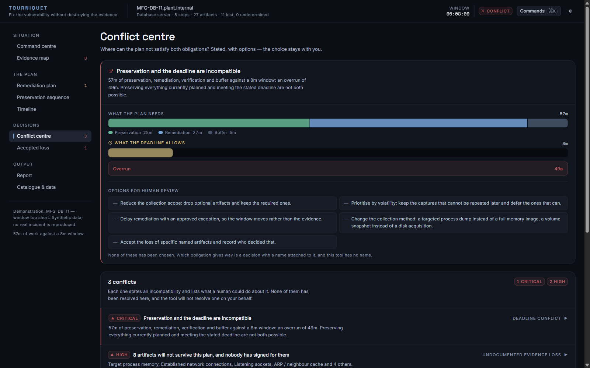

When preservation and the deadline cannot both be satisfied, TOURNIQUET draws the
incompatibility, lists what a human could do about it, and stops.

Reducing scope, delaying remediation under an exception, and accepting a named
loss are all legitimate answers. Which one is right depends on the business, the
regulator, the maintenance window and how badly somebody needs to know what
happened — none of which is visible from here. The options are rendered as prose
rather than buttons for the same reason: most of them are conversations with a
change board, not something a tool can carry out.

### Accepted loss

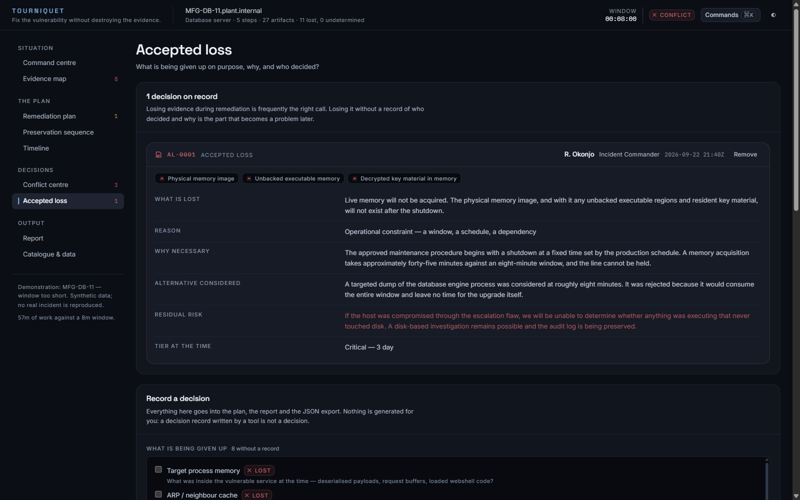

When evidence is going to be given up, the decision gets a record: what is lost,
why it was necessary, what else was considered, what nobody will be able to
determine afterwards, and who decided — a named person, not a team.

It is not an approval, it is not a compliance artifact, and it does not change
the outcome. **The record says somebody knew, not that the artifact survived.**
No legal or compliance language is generated, because the tool has no standing
to generate any.

### Human override

You can reorder the plan by hand. The tool will not stop you and will not
silently "fix" your order. What it will do is ask for a reason at the moment you
depart from the recommendation, show what the departure costs in the same breath,
and carry the reason into the plan, the report and the export.

---

## Reports

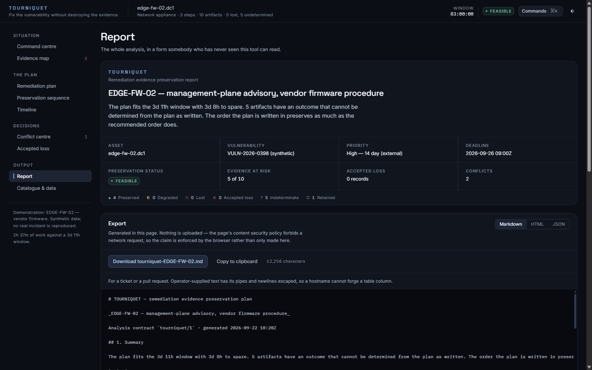

Three formats from one analysis — Markdown for a ticket, HTML for somebody who
will read it once and never open a terminal, JSON for anything that consumes it.

The first three sections are written so an incident commander can read them and
stop; everything after is for the analyst who has to execute the sequence.
Neither group should need to understand the source to trust the document, which
is why every section states what it is claiming and the last two state what the
tool cannot know.

---

## The demonstration

<!-- n:scenarios -->5 scenarios, all synthetic. The hostnames, vulnerabilities,
people and timestamps are invented; no vendor advisory, CVE record or real
incident is reproduced. Most are written the way plans actually get written
rather than the way they should be.

| Scenario | What it is for |
| --- | --- |
| **FIN-WEB-01** — internet-facing server | A change ticket with the evidence collection appended at the end. The steps are right; the order is not. |
| **PAY-K8S-07** — container workload | Redeploying from a clean image is the fix and the entire forensic cost. |
| **CORP-IDP** — credential compromise | Rotation and revocation destroy no stored record. What they destroy is visibility. |
| **EDGE-FW-02** — vendor firmware | A comfortable deadline and an uncharacterised procedure. Unknown stays unknown. |
| **MFG-DB-11** — window too short | Preservation and the change window are arithmetically incompatible. |

The flagship loads first. Its plan patches, restarts, verifies, and *then*
collects evidence — which is what a change ticket looks like when nobody has
thought about forensics yet. Against <!-- n:demo-artifacts -->28 artifacts in
scope it loses <!-- n:demo-lost -->6 and raises <!-- n:demo-conflicts -->3
conflicts. Pressing **Adopt the recommended order** changes no steps and no
remediation, and saves <!-- n:demo-saved -->5 of them.

That difference is the entire product.

---

## Running it

```bash
npm install
npm run dev
```

Open the printed URL. The demonstration loads immediately; there is nothing to
configure.

### Command line

The CLI runs the same engine with no build step — Node strips the types and
executes the sources directly.

```bash
node bin/tourniquet.ts demo mfg_db
node bin/tourniquet.ts demo fin_web --format markdown
node bin/tourniquet.ts analyse my-plan.json --strict
node bin/tourniquet.ts catalogue
```

`--strict` exits non-zero when a conflict has no decision record against it,
which makes it usable as a change-control gate. A conflict somebody has signed
for is treated as dealt with: failing a pipeline for it would punish the team for
doing the right thing.

### Everything

```bash
npm run verify
```

Lint, typecheck, the full test suite, a production build, the fixture check, the
README-number check, and the claim verification described in
[SECURITY.md](SECURITY.md).

---

## Architecture

```
src/
├── domain/        types, semantics, the volatility ladder, time, text escaping
│   ├── types.ts          the whole model, with the reasoning for each shape
│   ├── semantics.ts      what every state means, in words
│   ├── volatility.ts     the ladder, as data
│   ├── time.ts           the only module allowed to touch Date
│   └── text.ts           escaping, per output format
├── engine/        scope, impact, footprint, outcomes, sequence, deadline, conflicts
│   ├── impact.ts         specificity, then severity
│   ├── outcomes.ts       the simulation the whole interface is a view of
│   ├── sequence.ts       the preserve-first sequencer
│   ├── deadline.ts       feasibility, and refusing false precision
│   ├── conflicts.ts      where it cannot satisfy both obligations
│   └── report.ts         Markdown, HTML, JSON
├── data/          the evidence catalogue, the action library, the scenarios
├── ui/            tokens, primitives, situation map, loss boundary, icons
└── views/         one file per screen
bin/               the CLI, running the same engine with no build step
scripts/           fixtures, README numbers, claim verification, screenshots
docs/screenshots/  the images in this file, captured from the running app
```

The engine is pure and independently testable: no DOM, no clock, no network.
`eslint.config.js` enforces all three — `document`, `window`, `fetch` and `Date`
are banned inside `src/engine` and `src/domain`, with one documented exception
(`src/domain/time.ts`, which may convert an instant it was handed but never calls
`Date.now()`).

Consequence: the same plan analysed twice is byte-identical, which is what makes
the fixture check meaningful.

### If you read three files

1. [`src/domain/types.ts`](src/domain/types.ts) — the whole model.
2. [`src/engine/outcomes.ts`](src/engine/outcomes.ts) — the simulation.
3. [`src/data/actions.ts`](src/data/actions.ts) — the opinionated part.

### Dependency footprint

Five production dependencies: `react`, `react-dom`, and three `@fontsource`
packages. No UI framework, no chart library, no icon package, no date library, no
markdown renderer. Every chart, icon and layout here is hand-written, because a
dependency added for decoration is a supply-chain surface accepted for
decoration.

---

## Design

Two colour axes, kept strictly apart.

**Role** — what a thing *is*: `accent` blue is the product's own voice, `link`
cyan means a relationship between two objects, `time` gold is the clock and
nothing else.

**Fate** — what happens to evidence: emerald preserved, orange degraded, red
lost, violet unknown, slate retained.

The fate hues were **solved, not chosen**. Each is the least saturated colour at
an assigned luminance band, and the bands are spaced so every pair of the four
chromatic fates is at least 1.2:1 apart in contrast while each still clears WCAG
AA large-text against the lightest surface it sits on, in both themes.

That is not pedantry. An earlier hand-tuned pass had two of them 1.14:1 apart,
which is to say the same colour. [`tokens.test.ts`](src/ui/tokens.test.ts)
asserts the arithmetic off the same numbers that appear in `index.css`, so a
palette edit that breaks it fails the test run rather than shipping.

Colour is never the only signal. Every state carries an icon, a word and a
sentence, and the bar treatments — solid, hatched, severed — survive greyscale
and a printed report.

<details>
<summary><b>Light mode</b> — a re-specification, not an inversion</summary>

<br>

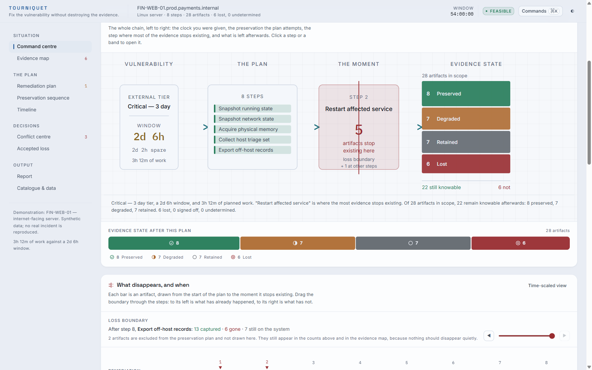

Both themes are specified independently. The light surfaces are tinted paper with
near-white panels lifting off them, because white panels on a white page need a
border to exist and a screen held together by borders reads as a form.

</details>

<details>
<summary><b>Mobile</b></summary>

<br>

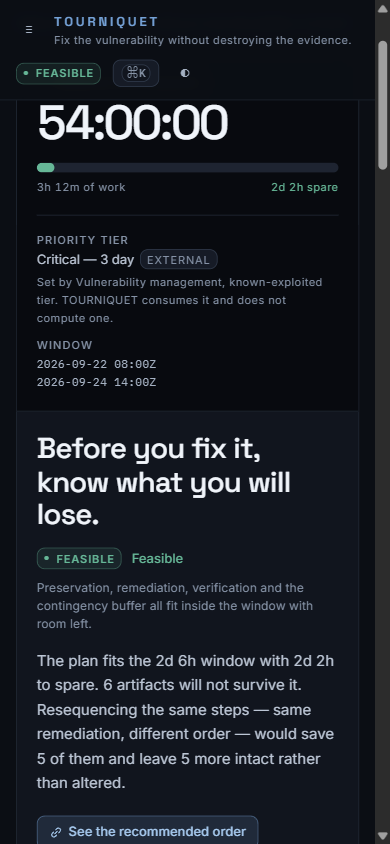

The dense diagrams scroll horizontally rather than reflowing into something that
would misrepresent them.

</details>

---

## Testing

```bash
npm test
```

The suite is organised around the claims that would be damaging to get wrong
rather than around line coverage:

| File | What it holds to account |
| --- | --- |
| [`impact.test.ts`](src/engine/impact.test.ts) | Rule specificity, severity tie-breaks, and that `unknown` never resolves to `preserves`. |
| [`outcomes.test.ts`](src/engine/outcomes.test.ts) | The central criteria. Memory captured before a reboot is preserved; captured after it, lost — *and the plan still contains the step*; reached by an uncharacterised step, indeterminate. |
| [`sequence.test.ts`](src/engine/sequence.test.ts) | Remediation order is never touched, volatile captures come first, no step is ever dropped, and no explanation claims a step reaches evidence it does not touch. |
| [`deadline.test.ts`](src/engine/deadline.test.ts) | The boundaries: an untimed step, an expired window, a plan that exactly fills its window, a zero-minute override. |
| [`catalogue.test.ts`](src/engine/catalogue.test.ts) | The shipped library against itself. Every tag an action targets exists, every capture names a real artifact, every declared destructive level agrees with the rules underneath it, and no asset type is offered an artifact it cannot collect. |
| [`analysis.test.ts`](src/engine/analysis.test.ts) | Every scenario's specific point, report escaping, and headline arithmetic. |
| [`hostile.test.ts`](src/engine/hostile.test.ts) | The untrusted-input path, attacked. Prototype pollution, type confusion, unbounded input, and thirteen injection payloads through every field into all three output formats. |
| [`tokens.test.ts`](src/ui/tokens.test.ts) | The palette, asserted numerically in both themes. |

---

## Limitations

Read these before quoting anything the tool produces.

- **It is an offline planning tool.** It does not acquire evidence, execute
  remediation, or connect to anything.
- **It is not a forensic acquisition system.** It decides ordering; your tooling
  and your team do the collection.
- **The action-to-evidence mappings are a curated synthetic library.** They
  describe how these platforms generally behave. They are not vendor statements
  and are not tested against your build. Where a relationship is genuinely
  uncertain the library says `unknown` rather than guessing — but a mapping being
  *present* is not evidence that it is right.
- **Environment-specific behaviour may be unknown**, and the tool says so rather
  than guessing.
- **Timing estimates are estimates**, order-of-magnitude figures rather than
  measurements of your environment. They exist so the arithmetic has something to
  work with.
- **Confidence is declared, not derived.** "High" means "follows from how the
  platform works", not "measured against a corpus".
- **Humans remain responsible for every decision.** The tool states
  incompatibilities; it resolves none of them.
- **It does not guarantee forensic completeness**, and no output should be read
  as implying that it does.
- **Retained means retained under the plan as analysed.** A colleague restarting
  the service, or an autoscaler replacing the node, is outside what this can see.
- **Preserving an artifact preserves what is there.** Timestamps, package state
  and local logs are attacker-modifiable; that is not the same as preserving the
  truth.
- **Steps are assumed to run serially** on a single worker, so a plan with
  parallelisable captures is counted conservatively.

---

## Security

The analysis runs in the page. Nothing is uploaded and nothing is stored, and
that claim is enforced by a `connect-src 'none'` content security policy, a lint
rule, and a build-time scan of the bundle rather than asserted once in prose.

Full threat model, trust boundaries, input-validation strategy, report-generation
hardening and disclosure process: **[SECURITY.md](SECURITY.md)**.

---

## Roadmap

Honest about what is missing rather than a list of promises.

- **Parallel capture.** The serial assumption is conservative but wrong for a team
  with two responders and two target hosts. Modelling it properly means modelling
  resource contention, which is a real scheduling problem rather than a flag.
- **Per-environment durations.** The right source for "how long does a memory
  acquisition take here" is the last ten times you did it, not a catalogue.
- **Multi-asset plans.** A remediation touching four hosts in sequence has
  cross-host ordering constraints this model cannot represent.
- **Rule provenance beyond a string.** `reference` is free text. Mappings carrying
  a citation and a review date would be worth more than mappings carrying a
  sentence.
- **Importing a real change ticket.** The plan format is hand-written JSON; the
  realistic input is an export from a change-management system.

---

## Licence

[Apache-2.0](LICENSE). All demonstration data is synthetic.
